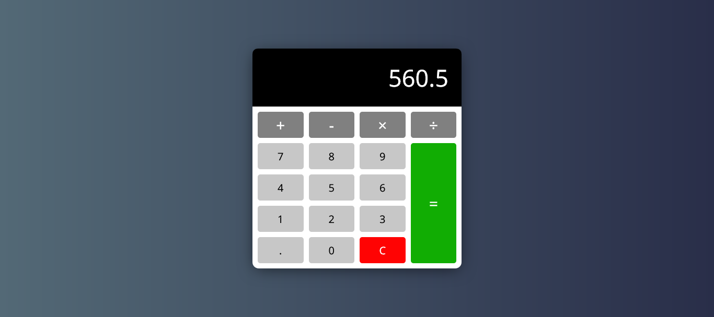

<h1>Calculator</h1>

<h2>A calculator created using HTML, CSS, and JavaScript.</h2>

This calculator was created using HTML, CSS, and JavaScript that lets calculate like a regular calculator. Screenshot of the task board.

- Live Site: [Calculator](https://calculator-project-1234.netlify.app/)

### Screenshot

